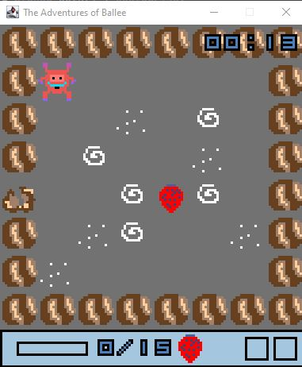

# Developer

Create by ELD games. Special thanks to E and L for contributing to art work and sounds

# Game Introduction

This is a 2D-RPG strawberry hunter game. The user controls our hero to collect all 15 strawberries to win. To achieve the goal, the player need to find item axe and boat as well.  (The code is only tested on Java 11)

## Usage

Tto start the game:

* In GameViewer/bin type `java -jar Game.jar` directly to game by using default axe and boat position

### In Main Game:

Key: `UP, LEFT, DOWN, RIGHT` to move, `SPACE` to do the action.

Xbox Controller: Using Jamepad.jar file as dependency.

## Developer Information

Please refer to Java doc comments for more.
